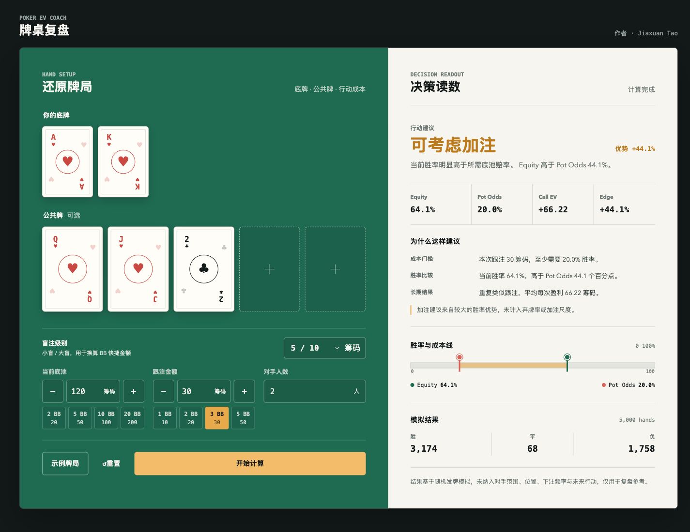

# Poker EV Coach 德扑决策助手 ♠️

Poker EV Coach 是一个用于**德州扑克单手牌复盘**的轻量 Web 工具。

当你打完一手牌，想知道“刚才这次跟注到底划不划算”，只需要选择自己的两张底牌、已知公共牌，填写底池、跟注金额和对手人数，工具就会通过 5,000 次随机发牌模拟，估算当前胜率并给出简化的弃牌、跟注或加注候选建议。

它不会要求注册账号，也不需要导入扑克平台记录。所有计算都在当前浏览器中完成，适合想快速理解一手牌、学习底池赔率，或验证一次跟注决策的玩家。

[🎮 在线体验](https://jiaxuan-tao.github.io/vibe-coding-lab/poker-ev-coach/) · [📊 如何理解结果](#-如何理解结果) · [⚠️ 能力边界](#-能力边界)

---

## 🖼️ 产品预览



左侧用于还原牌局和行动成本，右侧展示胜率、底池赔率、长期收益以及建议原因。

## 🎯 它解决什么问题

复盘一手德州扑克时，玩家通常记得自己的牌和下注金额，但不一定能快速判断：

- 当前牌面大约有多少胜率？
- 面对这次下注，至少需要多少胜率才值得跟注？
- 如果重复做同样的跟注，长期来看平均是盈利还是亏损？
- 系统为什么建议弃牌、跟注或把加注作为候选？

Poker EV Coach 将这些问题转换成可读的数字和解释，让用户不需要手动计算公式，也能看懂一次跟注决策背后的概率与成本关系。

## 🧭 使用方法

1. 选择自己的两张底牌。
2. 按当前牌局进度选择零至五张公共牌。
3. 选择盲注级别，填写当前底池、需要跟注的金额和对手人数。
4. 点击“开始计算”，等待 5,000 次模拟完成。
5. 查看行动建议、关键指标和“为什么这样建议”。

不知道从哪里开始时，可以点击“示例牌局”直接体验完整计算流程。

## 📊 如何理解结果

| 指标 | 它代表什么 | 怎么看 |
| --- | --- | --- |
| **Equity** | 当前牌面对所有对手的预计底池份额 | 数值越高，当前手牌整体胜算越大 |
| **Pot Odds** | 为了覆盖这次跟注成本，最低需要达到的胜率 | Equity 高于 Pot Odds 时，跟注才具备数学基础 |
| **Call EV** | 重复类似跟注时，平均每次获得或损失的筹码 | 正数表示长期平均盈利，负数表示长期平均亏损 |
| **Edge** | Equity 与 Pot Odds 的差值 | 正值表示胜率超过成本线，负值表示尚未覆盖成本 |

“为什么这样建议”会进一步说明：

- 本次跟注投入多少筹码，以及需要达到的最低胜率；
- 当前胜率高于或低于成本线多少个百分点；
- 重复类似决策时，长期平均盈利或亏损多少筹码。

“可考虑加注”只表示当前胜率明显高于跟注成本线，不代表系统已经计算出最优加注尺度。

## ✨ 核心功能

- 选择两张底牌和零至五张公共牌，自动禁用重复牌。
- 支持 `1/2` 至 `100/200` 的七档常用盲注级别。
- 根据大盲自动换算 BB 快捷金额，也可以手动输入或使用 `− / +` 调整整数筹码。
- 支持 1 至 8 名对手，并随机补全未知公共牌和对手底牌。
- 每次执行 5,000 次 Monte Carlo 随机模拟。
- 展示胜、平、负次数，以及 Equity、Pot Odds、Call EV 和 Edge。
- 根据计算结果提供简化的弃牌、跟注或加注候选建议。
- 使用具体数字解释建议原因，而不是只给出一个结论。
- 支持桌面与移动端布局、键盘焦点和降低动态效果偏好。

## ⚙️ 计算方式

1. 从 52 张牌中排除自己的底牌和已经出现的公共牌。
2. 每轮随机补全剩余公共牌，并为每位未知对手随机发两张牌。
3. 比较所有玩家可组成的最佳五张牌牌型；平局时按并列人数分配底池份额。
4. 重复模拟 5,000 次，汇总胜、平、负和预计底池份额。

核心指标使用以下公式：

```text
Equity = 模拟获得的底池份额 / 模拟次数

Pot Odds = 跟注金额 / (当前底池 + 跟注金额)

Call EV = Equity × (当前底池 + 跟注金额) − 跟注金额

Edge = Equity − Pot Odds
```

界面中的行动建议是基于 Equity、Pot Odds 和 Call EV 的简化判断：成本未被覆盖时建议弃牌；覆盖成本且胜率优势较大时标记为“可考虑加注”；其余情况建议跟注。

## 🛠️ 本地运行

项目没有运行时依赖，只需要支持 ES Modules 的现代浏览器。

```bash
git clone https://github.com/jiaxuan-tao/vibe-coding-lab.git
cd vibe-coding-lab/poker-ev-coach
python3 -m http.server 5175 --bind 127.0.0.1
```

然后打开 [http://127.0.0.1:5175/](http://127.0.0.1:5175/)。

运行自动测试：

```bash
npm test
```

## 🧱 技术实现

- **页面与交互**：HTML、CSS、Vanilla JavaScript
- **牌型评估**：枚举五张牌组合并比较牌型分数
- **胜率估算**：Monte Carlo 随机模拟
- **自动测试**：Node.js 原生测试运行器
- **部署方式**：GitHub Pages

项目不需要后端、数据库、账号系统或第三方分析服务。

## 📁 项目结构

```text
.
├── index.html              # 页面结构与可访问性语义
├── styles.css              # 响应式样式与组件状态
├── app.js                  # 输入状态、选牌、计算流程与结果渲染
├── poker.js                # 扑克牌型评估与 Monte Carlo 模拟
├── decision.js             # Pot Odds、Call EV、建议与解释规则
├── amount-controls.js      # 盲注换算与整数筹码控制
├── tests/                  # Node.js 自动测试
└── docs/                   # 设计、实施记录与项目图片
```

## ⚠️ 能力边界

- 对手底牌按均匀随机方式生成，没有建模真实玩家的起手牌范围。
- 结果未纳入位置、筹码深度、下注频率、弃牌率、隐含赔率和后续街行动。
- 单次 Monte Carlo 结果会有小幅波动，不能替代更大规模计算或专业求解器。
- “可考虑加注”没有计算弃牌收益和具体加注尺度。
- 本项目不是 GTO Solver，也不是实时自动下注工具。

请将结果用于学习和牌后复盘，不应用于规避扑克平台规则或自动化下注。

## 🤖 AI 辅助开发说明

项目通过 Vibe Coding 方式迭代。作者负责产品范围、计算口径、交互判断和最终验收，Codex 用于辅助实现、自动测试、代码审查与浏览器 QA。

关键公式、能力边界和交付结果均经过可重复测试或浏览器验证，不将 AI 生成内容直接视为策略结论。

## 📄 开源许可

[MIT License](LICENSE) © 2026 Jiaxuan Tao
