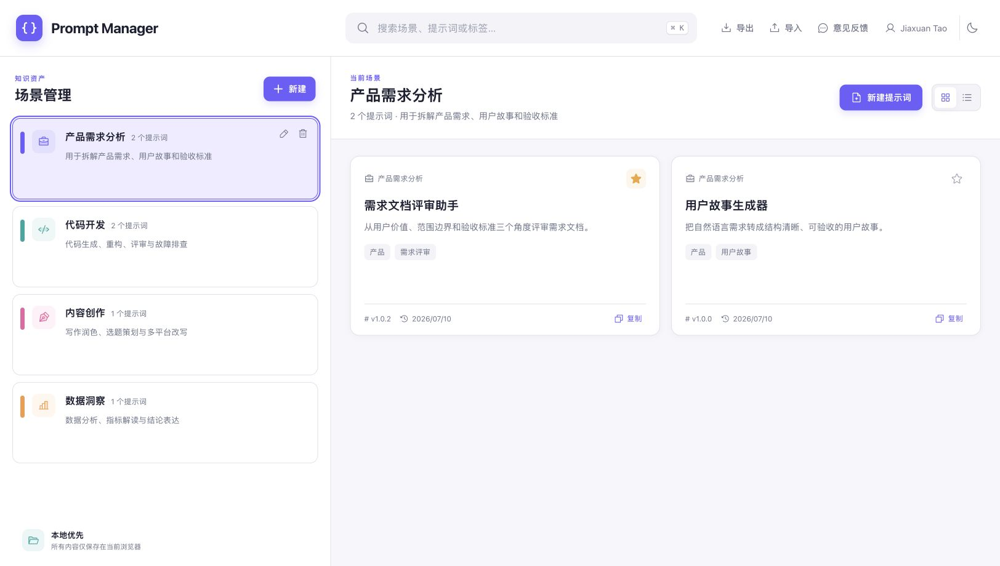
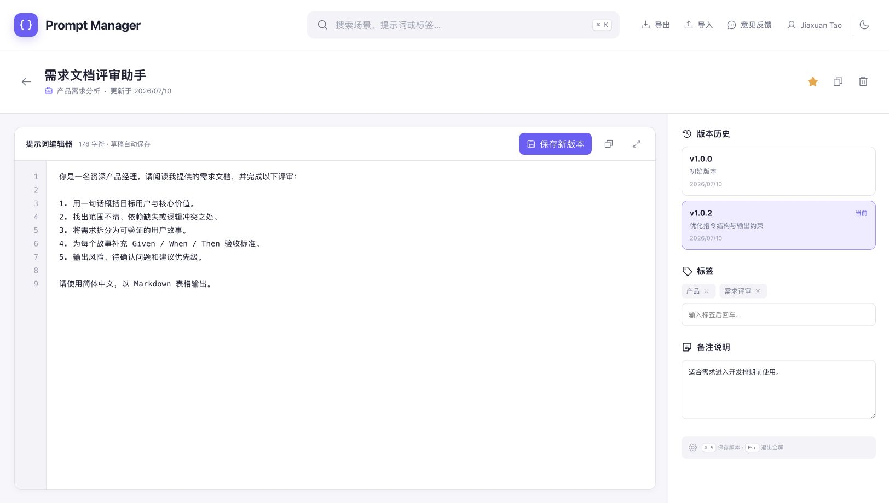

# Prompt Manager

一款纯本地、离线可用的提示词资产管理工具。用「场景 → 提示词 → 版本」三层结构整理日常 Prompt，并通过 IndexedDB 将全部内容保存在当前浏览器中。

在线体验：[https://jiaxuan-tao.github.io/ai-product-portfolio/prompt-manager/](https://jiaxuan-tao.github.io/ai-product-portfolio/prompt-manager/)





## 功能

- 场景管理：创建、编辑、删除场景，自定义图标与识别色
- 提示词管理：创建、编辑、复制、收藏、删除、标签和备注
- 版本管理：草稿自动保存，手动创建版本，预览历史并恢复为新版本
- 全文搜索：同时检索场景、标题、摘要、正文和标签
- 本地优先：不需要账户、后端或网络，数据不离开浏览器
- 数据流转：JSON 全量导出；导入前预览，支持合并或全量替换
- 界面体验：卡片/列表视图、浅色/深色主题、全屏编辑、键盘快捷键

## 技术栈

- React 19 + TypeScript + Vite
- Dexie / IndexedDB
- Phosphor Icons
- Vitest
- GitHub Actions + GitHub Pages

项目没有服务端、埋点或远程字体依赖。GitHub Pages 只托管静态文件，提示词数据始终位于访问者自己的浏览器中。

## 本地运行

```bash
npm install
npm run dev
```

生产构建与检查：

```bash
npx tsc --noEmit
npm test
npm run build
```

## 数据与版本规则

编辑正文时，当前草稿会在短暂停顿后自动写入 IndexedDB，但不会产生大量历史版本。点击「保存新版本」时才会递增补丁版本号，例如 `v1.1.0 → v1.1.1`。

恢复旧版本不会覆盖历史，而是把旧内容复制成一个新的当前版本。这样既能回到可靠内容，也能保留完整迭代轨迹。

导出文件包含以下结构：

```json
{
  "schemaVersion": 1,
  "exportedAt": "2026-07-10T00:00:00.000Z",
  "app": "Prompt Manager",
  "scenes": [],
  "prompts": [],
  "versions": []
}
```

合并导入会按 ID 更新重复内容并保留其他本地数据；全量替换会先清空当前数据。执行全量替换前建议先导出备份。

## 快捷键

- `⌘/Ctrl + K`：聚焦全局搜索
- `⌘/Ctrl + S`：在编辑页打开保存版本窗口
- `Esc`：退出全屏编辑

## 部署

推送到作品集仓库的 `main` 分支后，[Pages 工作流](../.github/workflows/pages.yml) 会自动构建并发布站点。仓库需要在 GitHub 的 **Settings → Pages → Build and deployment** 中选择 **GitHub Actions**；首次发布时也可由 `gh api` 配置。

## 隐私说明

Prompt Manager 不会把场景、提示词、版本、标签或备注发送到任何服务器。清理浏览器站点数据会删除本地资产，请定期使用导出功能备份。

## 开源许可

[MIT](LICENSE) © 2026 Jiaxuan Tao
