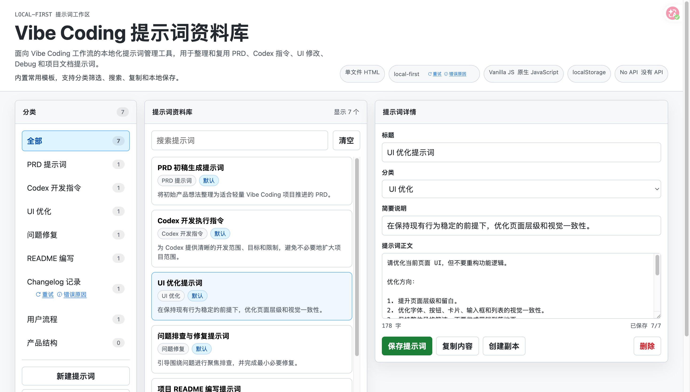

# Vibe Coding 提示词资料库

## 项目简介

Vibe Coding 提示词资料库是一个面向 Vibe Coding 工作流的本地化提示词管理工具，用于整理和复用 PRD、Codex 指令、UI 修改、问题修复和项目文档提示词。

这个项目是基于开源项目 [promptcat](https://github.com/sevenreasons/promptcat) 的轻量改造版本。它沿用 promptcat 的单页、零依赖、本地优先思路，将通用 Prompt 管理器收窄为个人 Vibe Coding 工作流中的提示词模板库。

当前版本不是完整 SaaS，也不是 AI 生成工具。它只是一个可以直接打开的单页 HTML 工具，用于沉淀和复用 PRD、Codex 指令、UI 修改、问题修复、README、Changelog、用户流程和产品结构等常用模板。

## 项目预览



中文本地化后的三栏提示词管理界面：左侧选择分类，中间查找模板，右侧查看、编辑和复制提示词内容。

## 背景

在日常 Vibe Coding 过程中，很多 Prompt 和 Codex 指令会反复出现：

- 开始一个项目时整理轻量 PRD。
- 让 Codex 修改代码时描述目标、范围和限制。
- 页面完成后继续做 UI 优化。
- 出现问题时用固定结构描述问题和复现步骤。
- 项目完成后补 README、Changelog、用户流程和产品结构。

这些内容如果分散在聊天记录、临时文档或历史项目中，会很难查找和复用。这个项目的目标是把这些高频模板集中到一个轻量的本地资料库中。

## 解决的问题

- Prompt 分散在不同对话和文件中，不容易沉淀。
- Codex 指令缺少固定结构，容易扩大修改范围。
- 文档类 Prompt 经常重复写，效率低。
- 轻量项目不需要复杂数据库、后端或云同步。
- 个人工作流更适合本地优先、可直接打开的小工具。

## 核心功能

- 内置 8 个 Vibe Coding 默认分类。
- 内置 8 个常用 Prompt 模板。
- 支持按分类筛选 Prompt。
- 支持标题、分类、说明和正文搜索。
- 支持查看 Prompt 详情。
- 支持一键复制 Prompt 正文。
- 支持新建、编辑、复制和删除 Prompt。
- 使用浏览器 `localStorage` 保存数据。
- 无构建流程，可直接打开 [app/index.html](app/index.html) 使用。

## 当前范围

当前版本只关注个人本地 Prompt 资产管理：

- 做：Prompt 分类、模板浏览、搜索、复制、本地保存。
- 做：围绕 Vibe Coding 工作流重新组织默认内容。
- 不做：登录注册、云同步、团队协作、AI API、后端服务、支付订阅。
- 不做：复杂权限、复杂数据库、完整导入导出系统。

## 使用方法

1. 打开 [app/index.html](app/index.html)，或按下方“本地运行”方式在浏览器中访问项目。
2. 在左侧选择提示词分类，例如 PRD 提示词、Codex 开发指令或 UI 优化。
3. 在中间列表选择模板，也可以通过搜索框查找所需内容。
4. 在右侧查看提示词正文，并按当前项目补充或修改标题、说明和正文中的占位内容。
5. 点击“复制内容”，将提示词粘贴到 Codex 或其他 AI 对话中使用。
6. 点击“保存提示词”保存自己的版本；也可以通过“创建副本”在默认模板基础上继续修改。
7. 需要回到初始模板时，点击“恢复默认模板”。此操作会清除当前浏览器中保存的自定义内容。

## 本地运行

可以直接打开 [app/index.html](app/index.html)。如果浏览器或系统环境限制直接打开 HTML 文件，可在 `app/` 目录启动本地静态服务：

```bash
cd vibe-coding-prompt-library/app
python3 -m http.server 8765 --bind 127.0.0.1
```

然后访问 [http://127.0.0.1:8765/](http://127.0.0.1:8765/)。

## 数据保存说明

所有数据保存在当前浏览器的 `localStorage` 中。换浏览器或清理站点数据后，本地保存内容不会自动迁移。

“恢复默认模板”会将提示词资料库恢复为内置模板，因此应在确认不再需要本地自定义内容后再使用。

## 项目结构

```text
vibe-coding-prompt-library/
├── README.md
├── assets/
│   └── vibe-coding-prompt-library-preview.png
├── app/
│   └── index.html
└── docs/
    ├── PRD.md
    ├── user-flow.md
    ├── product-structure.md
    ├── prompts.md
    ├── changelog.md
    └── reference.md
```

## Vibe Coding 改造过程

本次改造过程按轻量二改方式推进：

1. 参考 promptcat 的单文件、零依赖、本地优先形态。
2. 将产品定位从通用提示词管理器收窄为 Vibe Coding 提示词模板库。
3. 替换默认分类为 PRD 提示词、Codex 开发指令、UI 优化、问题修复、README 编写、Changelog 记录、用户流程和产品结构。
4. 内置 8 个面向个人开发工作流的提示词模板。
5. 保留直接打开 HTML 文件即可使用的方式。
6. 补齐项目 README、PRD、用户流程、产品结构、Prompt 记录、changelog 和参考说明。

## 参考来源

- 原始项目：[promptcat](https://github.com/sevenreasons/promptcat)
- 演示地址：[https://sevenreasons.github.io/promptcat/](https://sevenreasons.github.io/promptcat/)

本项目是基于开源项目 promptcat 的轻量改造版本。

## 开源说明

promptcat 的公开 README 中标注了 WTFPL license badge，并说明其实现为 HTML、CSS、Vanilla JS、零依赖、单 HTML 文件、本地 IndexedDB 存储。

本项目保留对 promptcat 的合理归因，并在产品文档中明确说明改造来源。当前版本主要复用其产品形态和本地优先思路，具体页面文案、默认模板和 Vibe Coding 信息结构为本项目新增内容。

如后续更大范围复用 promptcat 原始代码，应继续保留上游项目名称、链接和协议说明，并在发布前再次确认上游仓库的最新 license 状态。

## 后续计划

- 增加更多项目类型的提示词模板。
- 增加 JSON 导入 / 导出。
- 增加标签筛选。
- 增加模板版本记录。
- 补充更多手动验收截图和使用记录。
